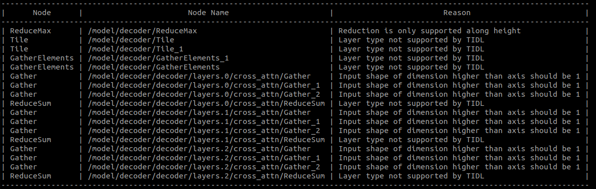
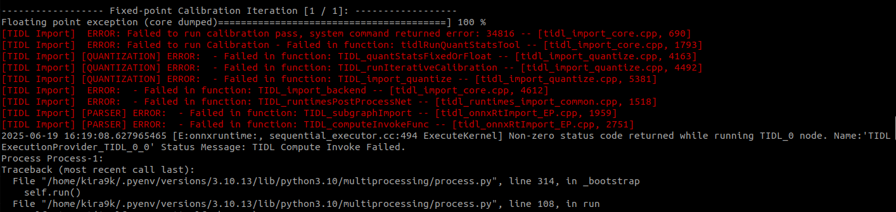

# Изменения в коде для поддержки компиляции TIDL версии 11_00_06_00

## Оглавление
- [Tidl не поддерживает динамические оси](#tidl-не-поддерживает-динамические-оси)
- [Исправление неподдерживаемых слоев в декодере](#исправление-неподдерживаемых-слоев-в-декодере)
    - [Reducemax | model/decoder/reducemax | Reduction is only supported along height](#reducemax--modeldecoderreducemax--reduction-is-only-supported-along-height)
    - [Tile | /model/decoder/Tile | Layer type not supported by TIDL|](#tile--modeldecodertile--layer-type-not-supported-by-tidl)
    - [GatherElements | /model/decoder/GatherElements | Layer type not supported by TIDL](#gatherelements--modeldecodergatherelements--layer-type-not-supported-by-tidl)
    - [Gather | model/decoder/decoder/layers.0/cross_attn/Gather](#gather--modeldecoderdecoderlayers0cross_attngather)
    - [ReduceSum | /model/decoder/layers.2/cross_attn/ReduceSum](#reducesum--modeldecoderlayers2cross_attnreducesum)
- [Ошибки во время компиляции](#ошибки-во-время-компиляции)
    - [Исправление бэкбона](#исправление-бэкбона)
- [Долгая компиляция](#долгая-компиляция)
    - [Выносим функцию ```_generate_anchors()``` вне модели](#выносим-функцию-_generate_anchors-вне-модели)

## TIDl не поддерживает динамические оси

Т.к. TIDL не поддерживает динамические оси, то при конвертации в onnx заккоментируем данную срточку. Также, оставим модель без постпроцессинга для анализа.

```python
torch.onnx.export(
    model,
    (data), #was (data, size)
    args.file_name,
    input_names=['images'], #was ['images', 'orig_target_size']
    output_names=['boxes', 'scores'], #was ['labels', 'boxes', 'scores']
    #dynamic_axes=dynamic_axes,
    opset_version=16,
    verbose=False)
```

Измененный код для построения модели

```python
class Model(nn.Module):
    def __init__(self, ) -> None:
        super().__init__()
        self.model = cfg.model.deploy()
        #self.postprocessor = cfg.postprocessor.deploy()
        #print(self.postprocessor.deploy_mode)

    def forward(self, images):
        outputs = self.model(images)
        return outputs  #self.postprocessor(outputs, orig_target_sizes)

model = Model()
```

На данном этапе имеем следующие ошибки


## Исправление неподдерживаемых слоев в декодере

### ReduceMax | /model/decoder/ReduceMax | Reduction is only supported along height

Ошибка происходит  в классе ```RTDETRTransformer``` в функции ```_get_decoder_input()``` в это строчке:

```python
_, topk_ind = torch.topk(enc_outputs_class.max(-1).values,
                                 self.num_queries,
                                 dim=1)
``` 

Для решения этой проблемы сначала необходимо сохранить модель с предсказанием всего одного класса, как это требует задача. Далее, заменим операцию ```max``` на:
```python
_, topk_ind = torch.topk(enc_outputs_class.reshape(
            1, enc_outputs_class.shape[1]),
                                 self.num_queries,
                                 dim=1)
```

### Tile | /model/decoder/Tile | Layer type not supported by TIDL|

Ошибки, связанные с ```Tile``` происходят в классе ```RTDETRTransformer``` в функции ```_get_decoder_input()``` в этих строчках:

```python
reference_points_unact = enc_outputs_coord_unact.gather(dim=1, 
            index=topk_ind.unsqueeze(-1).repeat(1, 1, enc_outputs_coord_unact.shape[-1]))
```

```python
target = output_memory.gather(dim=1, index=topk_ind.unsqueeze(-1).repeat(1, 1, output_memory.shape[-1]))
```

Это происходит из-за того, что после конвертации в ONNX ```Tile``` становится операцией ```repeat```, которая не поддерживается TIDL-ом. Также, данная строчка имеет операцю ```gather```, которая после конвертации становится ```GatherElements```, что не поддерживает TIDl. Об этом в следующей главе

### GatherElements | /model/decoder/GatherElements | Layer type not supported by TIDL

В предыдущей главе упоминалась эта ошибка. Для устранения её и ошибки с ```Tile``` перепишем код. Добавим индексы для ```enc_outputs_class```.

```python
_, topk_ind2 = torch.topk(enc_outputs_class.reshape(
    enc_outputs_class.shape[1]),
                        self.num_queries,
                        dim=0)
```

Заменим операцию ```gather``` на ```index_select```:

```python
reference_points_unact = torch.index_select(enc_outputs_coord_unact,dim=1,index=topk_ind2)
```

```python
target = torch.index_select(output_memory, dim=1, index=topk_ind2)
```

### Gather | model/decoder/decoder/layers.0/cross_attn/Gather

Данная ошибка возникает в файле ```utils.py``` в строчке: 

```python
sampling_grid_l_ = sampling_grids[:, :, :,level].permute(0, 2, 1, 3,4).flatten(0, 1)
```

Заменим операцию извлечения по индексу на свертку путем маскирования. Создадим файл ```conv_layer.py``` и будем добавлять туда свертки. Для исправления данной ошибки свертка выглядит так:
```python
class ConvLevel(nn.Module):

    def __init__(self, channels=300, height=3, level=1):
        super().__init__()
        self.channels = channels
        self.level = level

        # 1xH сверточный слой
        self.conv = nn.Conv2d(in_channels=channels,
                              out_channels=channels,
                              kernel_size=(height, 1),
                              stride=1,
                              padding=0,
                              bias=False)

        with torch.no_grad():
            self.conv.weight.zero_()
            for c in range(channels):
                self.conv.weight[c, c, level, 0] = 1.0

    def forward(self, input):
        B, C, L, H, W, _ = input.shape

        x = input.permute(5, 0, 1, 2, 3, 4).reshape(-1, C, L, H, W)
        x = x.permute(0, 2, 1, 3, 4).reshape(-1, C, H, W)
        x = self.conv(x)  # (B*2*L, C, 1, W)
        x = x.reshape(-1, L, C, W).permute(0, 2, 1, 3)
        x = x.reshape(2, B, C, L, W).permute(1, 2, 3, 4, 0)  # (B, C, L, W, 2)
        return x
```
Инициализация сверток происходит в классе ```MSDeformableAttention```:
```python
self.conv_level0 = ConvLevel(channels=300, height=3, level=0)
self.conv_level1 = ConvLevel(channels=300, height=3, level=1)
self.conv_level2 = ConvLevel(channels=300, height=3, level=2)
```

Далее создаем список из данных сверток:
```python
lst_conv = [self.conv_level0, self.conv_level1, self.conv_level2]
```
и передаем в качестве параметра в функцию ```self.ms_deformable_attn_core```. Таким образом, в данной функции свертки вызываются для каждого ```level``` и вместо извлечения по индексу записаны так:

```python
sampling_grid_l_ = lst_conv[level](sampling_grids).permute(0, 2, 1, 3, 4).flatten(0, 1)
```

### ReduceSum | /model/decoder/layers.2/cross_attn/ReduceSum

Данная ошибка возникает в файле ```utils.py``` в строчке
```python
output = (torch.stack(sampling_value_list, dim=-2).flatten(-2) * attention_weights).sum(-1).reshape(bs, n_head * c, Len_q)
```

из-за операции ```sum(-1)```. Для замены создадим класс, который на вход принимает ```(torch.stack(sampling_value_list, dim=-2).flatten(-2) * attention_weights)``` и реализует суммирование по последней оси с помощью матричного умножения. Класс представлен в файле ```conv_layer.py``` и показан ниже 

```python
class FixedSumMatmul(nn.Module):

    def __init__(self, feature_dim=9):
        super().__init__()
        self.feature_dim = feature_dim
        self.ones = nn.Parameter(torch.ones(feature_dim, 1),
                                 requires_grad=False)

    def forward(self, x):
        """
        x: [batch, channels, seq_len, features]
        output: [batch, channels, seq_len]
        """
        batch, channels, seq_len, features = x.shape
        assert features == self.feature_dim, f"Expected features={self.feature_dim}, got {features}"
        out = torch.matmul(x, self.ones)
        output = out.reshape(batch, channels, seq_len)

        return output
```

Таким образом, реализация выглядит так: в классе ```MSDeformableAttention``` инициализируем модель 

```python
self.fixed_sum_matmul = FixedSumMatmul(feature_dim=9)
```
и передаем её в качестве параметра в функцию ```self.ms_deformable_attn_core```. В данной функции реализация выглядит так: 

```python
weighted = torch.stack(sampling_value_list,dim=-2).flatten(-2) * attention_weights
output = fixed_sum_matmul(weighted).reshape(bs, n_head * c, Len_q)
```

## Ошибки во время компиляции

Даже после замены всех непподерживаемых слоев, в процессе компиляции возникает ошибка



### Исправление бэкбона

В RTDETR в качестве бэкбона используется PResnet18. Он имеет слои пулинга с параметром ```seil_mode=True```. Для исправления нужно заменить значение ```True``` на ```False```
 

## Долгая компиляция

При всех исправлениях компиляция занимает достаточно много времени, что возникает, скорее всего, из-за неправльной обработке некоторых слоев TIDL-ом.

### Выносим функцию ```_generate_anchors()``` вне модели

Для ускорения компиляции было принято вынести генерацию якорей за модель, и подавать на вход декодера ```anchors``` и ```valid_mask```

```python
class Model(nn.Module):

    def __init__(self):
        super(Model, self).__init__()
        self.backbone = model_fpn
        self.encoder = model_enc
        self.decoder = model_transformer_decoder

    def forward(self, x, anchors, valid_mask):
        feats = self.backbone(x)
        print(f"Backbone output: {[f.shape for f in feats]}")
        enc = self.encoder(feats)
        print(f"Enc output: {[f.shape for f in enc]}")
        x = self.decoder(enc, anchors=anchors, valid_mask=valid_mask)
        return x
```

Для этого в методе ```_get_decoder_input()``` и ```forward()``` класса ```RTDETRTranformer``` надо добавить 2 аргумента - ```anchors``` и ```valid_mask``` и переопределить переменные в функции ```_get_decoder_input()```

```python
anchors, valid_mask = anchors, valid_mask
```


